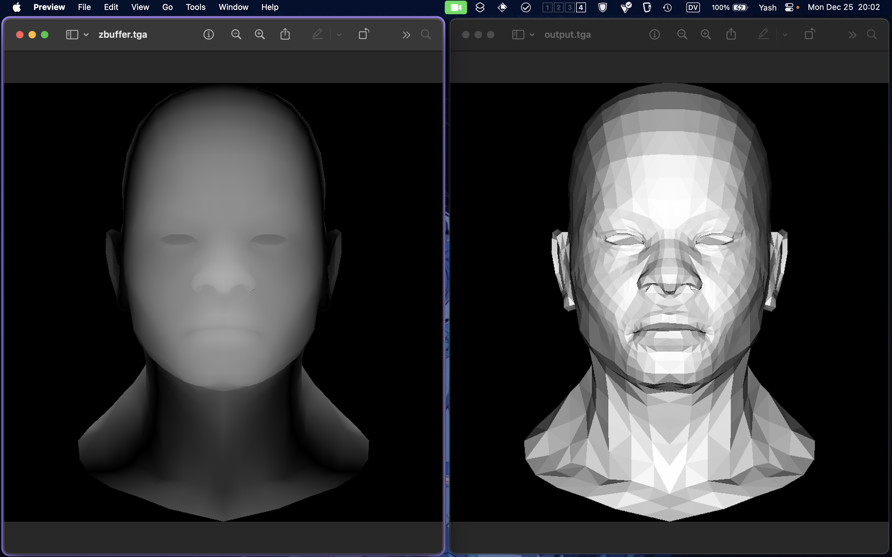

Dead simple rasterization engine I wrote in cpp for fun.

  
  

**Helpful links:**
- https://github.com/ssloy/tinyrenderer/wiki/
- https://raytracing.github.io/books/RayTracingInOneWeekend.html
- https://www.scratchapixel.com/index.html
- https://g5m.cs.washington.edu/
- https://student.cs.uwaterloo.ca/~cs488/Fall2023/index.html

~~Finally used y = mx + c in real life~~

**More imgs:**
 
 
 

